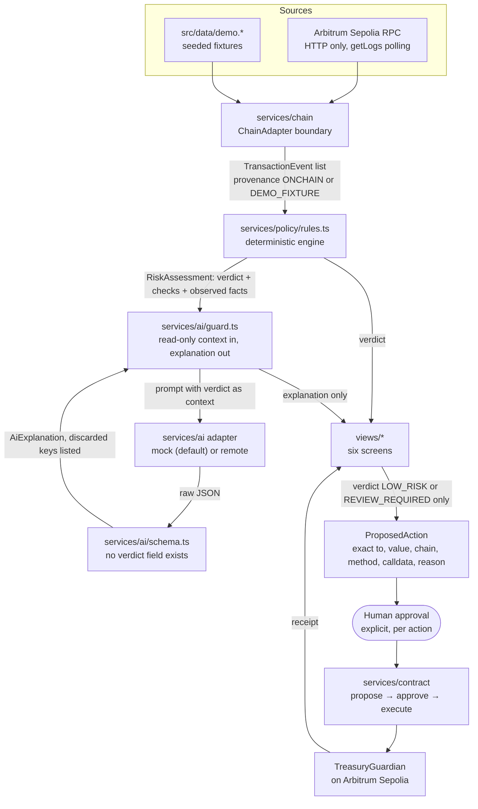

# Architecture

This codebase makes one architectural claim. **The risk verdict is produced by
deterministic code, and nothing downstream can change it, including the model.**
Everything below exists to make that claim checkable.

## Data flow



What the diagram leaves out matters as much as what it shows. No arrow runs
from the AI back into the verdict, and no arrow runs from the UI to the chain
without passing through the human.

## Module layout

The brief's layout maps onto a Vite project as follows.

| Brief | Repository | Contains |
|---|---|---|
| `components/` | `src/components/` | Reusable UI: icons, risk chips, notices, tables, record cards, skeletons, agent steps, the status strip |
| `views/` | `src/views/` | The six screens, composition only |
| `services/` | `src/services/` | `wallet/`, `chain/`, `contract/`, `ai/`, plus `policy/` and `agent/` |
| `types/` | `src/types/` | Shared domain types |
| `data/` | `src/data/` | `demo.*` deterministic fixtures |
| `contracts/` | `contracts/` | Solidity, Hardhat tests, deploy script |

The landing page lives in `src/landing/` and ships in the same bundle.
`src/main.tsx` renders it for `/` and the dashboard for `/app`. Every figure it
shows is measured from the repository, and `src/landing/stats.ts` records how.
The verdict object in its evidence section is produced at load time by the real
policy engine rather than transcribed.

Supporting directories: `src/config/` (verified network facts, environment and
policy configuration), `src/lib/` (address and formatting helpers with no chain
dependency), `src/state/` (one provider, one hash router).

## The four boundaries

### 1. Chain adapter boundary, `src/services/chain/types.ts`

`ChainAdapter` is the only chain-facing interface the rest of the app knows.

```ts
getNetworkStatus({ connectedChainId, now }) -> NetworkStatus
getTreasurySnapshot(now)                    -> TreasurySnapshot
getRecentEvents({ limit })                  -> TransactionEvent[]
getReceipt(hash)                            -> ReceiptSummary | null
```

Two implementations satisfy it. `viemAdapter.ts` uses HTTP transport, `getLogs`
polling and receipt verification; `demoAdapter.ts` serves fixtures. No view, no
policy rule and no AI code imports `viem`, so the transport can be replaced
without touching a screen.

Constraints encoded here:

- HTTP transport only. The public Arbitrum RPC has no WebSocket, so there is no
  `webSocket()` call and no subscription watcher in the repository. An ESLint
  rule fails the build if one appears.
- If the RPC reports a chain id other than 421614, the adapter refuses to read
  from it rather than trusting the configured value.
- `getReceipt` returns `null` when a transaction is not mined. It never
  synthesises a hash or reports a success it did not see.

### 2. Demo Mode boundary, `src/config/env.ts` and the adapter factories

Demo Mode is one boolean, resolved in one place, that swaps adapters at the
factory. It turns on when `VITE_DEMO_MODE=true`, and also as an automatic
fallback when a live read throws `ChainUnavailableError`.

- Every record a demo adapter produces carries `provenance: 'DEMO_FIXTURE'`.
- The UI renders provenance on **every** event row and card, not only in
  Settings, as a quiet monospace mark, plus one chip in the status strip.
- Fixtures are deterministic. They use a seeded PRNG and a fixed clock
  (`DEMO_CLOCK_SECONDS`), with no `Math.random` and no `Date.now` at module
  scope. An ESLint rule blocks `Math.random`, so screenshots do not drift.
- In Demo Mode the contract service records a decision locally and states that
  nothing was broadcast and that no transaction hash exists.

### 3. Policy boundary, `src/services/policy/rules.ts`

One pure function, `(event, policy, evaluatedAt) -> RiskAssessment`. It does no
I/O, has no randomness, takes no model input and cannot see anything the AI
produced. It emits the verdict, the per-rule checks with their details,
plain-language reasons, and the list of `ObservedFact`s that the model is
allowed to cite.

Severity ordering is explicit. `BLOCKED` beats `REVIEW_REQUIRED`, which beats
`INSUFFICIENT_DATA`, which beats `LOW_RISK`, and the most severe failing rule
wins.

### 3b. Wallet boundary, `src/services/wallet/`

`eip6963.ts` keeps a live registry of wallets that answered
`eip6963:requestProvider`. `catalog.ts` turns that registry into the rows the
picker renders, always including MetaMask, Bitget Wallet and Rabby whether or
not they are installed. `walletService.ts` holds the one provider the human
chose, so later chain reads, switch requests and contract writes address that
same wallet rather than whichever one last claimed `window.ethereum`. That
legacy provider is a fallback for when nothing announces itself.

The chain guard sits outside this module. A connection reports whatever chain
the wallet is on, and `NetworkStatus` turns anything that is not 421614 into
`WRONG_NETWORK`. Nothing rewrites a chain id to look supported.

### 4. AI boundary, `src/services/ai/`

```
adapter -> raw output -> parseModelJson -> validateAiExplanation -> applyAiOutput -> UI
```

- `schema.ts` reads exactly five keys (`summary`, `rationale`, `citedFactIds`,
  `recommendation`, `caveats`). There is no verdict key to read, and every
  other key the model returned is collected into `ignoredModelFields` and shown
  in the UI as discarded.
- `guard.ts` takes the `RiskAssessment` and returns **the same object by
  identity**. There is no code path in the module that constructs a different
  verdict.
- A recommendation weaker than the verdict sets
  `recommendationConflictsWithPolicy`, which the UI renders as "the model is
  softer than policy, and policy wins".
- Every failure produces `status: 'UNAVAILABLE'` with the reason shown, and the
  verdict and evidence still render. That covers an unreachable provider,
  non-JSON output, an invented fact id and an out-of-vocabulary recommendation.

`src/services/ai/guard.test.ts` tests this against hostile payloads: a returned
`verdict`, an `override` flag, prompt-injection text in the rationale, invented
citations, malformed JSON and an adapter that throws.

## Agent run order

`src/services/agent/agentRunner.ts` runs four visible steps, and their order
carries the safety argument.

1. **Fetch.** Record where the event came from, chain or fixture.
2. **Classify.** Decode recipient, value and method, describing without judging.
3. **Policy.** Run the deterministic rules. The verdict exists from here on.
4. **Recommend.** Call the model with the verdict as read-only context.

Steps 1 to 3 never touch the model. Step 4 cannot change what they produced.

## Contract boundary

`TreasuryGuardian` mirrors the frontend policy on chain, so the interface
cannot widen what is permitted.

| Frontend rule | On-chain enforcement |
|---|---|
| Recipient allowlist | `isAllowedRecipient`, immutable, checked on propose and execute |
| Method allowlist | `isAllowedMethod`, immutable, checked on propose and execute |
| Transfer limit | `maxTransferWei`, immutable, checked on propose and execute |
| Explicit approval | `execute` reverts unless status is `Approved` |
| Single authorised approver | `approver`, immutable, `onlyApprover` on approve/reject/execute |

A `method` is a `bytes4` label tag, computed as `bytes4(keccak256(bytes(label)))`
and used for classification and allowlisting. It never dispatches a call. The
only value movement in the contract is a native transfer to an allowlisted
recipient.

## Configuration and refusal

`loadConfig` throws if `VITE_CHAIN_ID` is anything other than `421614`, so the
app cannot be pointed at another network by configuration. `FORBIDDEN_CHAINS`
names Ethereum mainnet, Arbitrum One and Arbitrum Nova in one place, used only
to explain a refusal.

## Visual system

The interface is built to read like an instrument rather than a marketing page.

- **Surfaces lift in steps** on a near-black canvas. `--canvas #061512` sits
  under `--surface-1 #0C2320` for cards and `--surface-2 #113029` for raised
  ones. The teal family is used for borders, the network mark and emphasis
  rather than for the shell.
- **Two type roles, applied without exception.** Plus Jakarta Sans sets
  headings and prose. JetBrains Mono with tabular figures sets every piece of
  data: addresses, amounts, timestamps, method names, chain ids, block numbers
  and hashes. Prose inside a data slot opts back out with `.prose`.
- **Rows are tight where data is, and sections are far apart.** Table rows use
  6px by 12px padding. Sections are separated by 32px and introduced by a ruled
  heading.
- **Lime is rare.** It marks the primary action and the low-risk status.
  Amber and red are semantic. Risk carries an icon, a word and a colour, and
  each verdict icon has its own silhouette so nothing depends on hue.
- **Signals are ranked.** One compact status line carries the Demo Mode,
  wallet, network and contract conditions and expands on demand, which keeps
  the treasury readout above the fold on a phone. Provenance stays quiet.
- **Mobile is a first-class layout.** A 52px header holds the mark, the network
  badge and the wallet control, navigation moves to the bottom, and wide tables
  become record cards.

## Testing strategy

| Layer | Test | What it protects |
|---|---|---|
| Policy | `src/services/policy/rules.test.ts` | Each rule → expected verdict, severity ordering, purity |
| AI boundary | `src/services/ai/guard.test.ts` | A hostile model cannot change a verdict |
| AI schema | `src/services/ai/schema.test.ts` | Malformed and invented output is rejected |
| Fixtures | `src/data/demo.fixtures.test.ts` | Determinism, provenance, every verdict reachable |
| Wallet | `src/services/wallet/catalog.test.ts` | Every known wallet is always listed; detected wallets are marked and never duplicated |
| Config | `src/config/env.test.ts` | Refusal of other chain ids, safe fallbacks |
| Formatting | `src/lib/format.test.ts` | Exact wei arithmetic, fixed UTC timestamps |
| Contract | `contracts/test/TreasuryGuardian.test.ts` | The approval boundary and every allowlist limit |
